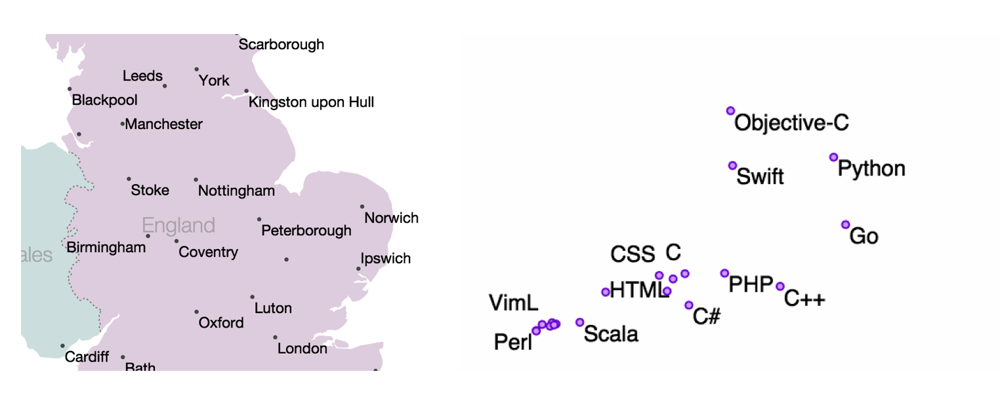

# d3fc-label-layout

A D3 layout that places labels avoiding overlaps, with strategies including simulated annealing, greedy and a strategy that removes overlapping labels.



For a live demo, see the [GitHub Pages site](http://d3fc.github.io/d3fc-label-layout/).

[Main d3fc package](https://github.com/ScottLogic/d3fc)

# Installation

```bash
npm install d3fc-label-layout
```

# API

## General API

The label layout component provides a mechanism for arranging child components based on their rectangular bounding boxes. It is typically used to render labels on maps or charts. A layout strategy is passed to the component in order to arrange the child rectangles avoiding collisions or remove overlaps.

## Example usage

```javascript
var labelPadding = 2;

// the component used to render each label
var textLabel = fc_layout.textLabel()
  .padding(labelPadding)
  .value(function(d) { return d.properties.name; });

// a strategy that combines simulated annealing with removal
// of overlapping labels
var strategy = fc_layout.removeOverlaps(fc_layout.greedy());

// create the layout that positions the labels
var labels = fc_layout.label(strategy)
    .size(function(d) {
        // measure the label and add the required padding
        var textSize = d3.select(this)
            .select('text')
            .node()
            .getBBox();
        return [textSize.width + labelPadding * 2, textSize.height + labelPadding * 2];
    })
    .position(function(d) { return projection(d.geometry.coordinates); })
    .component(textLabel);

// render!
svg.datum(places.features)
     .call(labels);
```

The above snippet is taken from block [389c76c6a544af9f0cab](http://bl.ocks.org/ColinEberhardt/389c76c6a544af9f0cab) which provides a complete example showing how this label layout component can be used to arrange labels on a map.

## Label

*d3fc*.**label**(*strategy*)

Constructs a new label layout with the given *strategy*. The label layout creates an array of rectangle bounding boxes which are passed to the strategy, which will typically move the boxes in order to minimise overlaps. Once the layout is complete a data join is used to construct a containing `g` element for each item in the bound array, and the component supplied to the layout is 'call'-ed on each element.

Each `g` element has the following properties set:

 - `layout-width`, `layout-height` - the width and height of this label, as provided by the `size` property.
 - `display` - set to `inherit` or `hidden`, based on whether the strategy has hidden this label.
 - `anchor-x`, `anchor-y` - the original label location in relative coordinates to the this `g` element.


*label*.**size**(*accessor*)

Specifies the size for each item in the associated array. The *accessor* function is invoked exactly once per datum, and should return the size as an array of two values, `[width, height]`. The *accessor* function is invoked with the datum, and index. This function is invoked after the component has been rendered, and the value of the *this* context is the containing `g` element. As a result, you can measure the size of the component if the contents are dynamic, for example, measuring the size of a text label.

*label*.**position**(*accessor*)

Specifies the position for each item in the associated array. The *accessor* function is invoked exactly once per datum, and should return the position as an array of two values, `[x, y]`.

*label*.**component**(*component*)

Specified the component that is used to render each label.

## Strategy

The label component uses a strategy in order to re-locate labels to avoid collisions, or perhaps hide those that overlap.

The strategy is supplied an array of objects that describe the initial location of each label, as obtained via the `position` and `size` properties of `layout`.

Each object has the following structure:

```
{
    hidden: ...,
    x: ...,
    y: ...,
    width: ...,
    height: ...,
}
```

The strategy should return an array of objects indicating the placement of each label.

### Greedy

The greedy strategy is a very fast way of reducing label overlap. It adds each label in sequence, selecting the position where the label has the lowest overlap with already added rectangles and is inside the container.

*d3fc*.**greedy**()

Constructs a greedy strategy.

*greedy*.**bounds**(*array*)

Optionally specifies a bounding region, as an array of two values, `[width, height]`. The strategy will try to keep labels within the bounds.

### Simulated Annealing

The simulated annealing strategy runs over a set number of iterations, choosing a different location for one label on each iteration. If that location results in a better result, it is saved for the next iteration. Otherwise, it is saved with probability inversely proportional with the iteration it is currently on. This helps it break out of local optimums, hopefully producing better output. Because of the random nature of the algorithm, it produces variable output.

*d3fc*.**annealing**()

Constructs an annealing strategy.

*annealing*.**bounds**(*array*)

Optionally specifies a bounding region, as an array of two values, `[width, height]`. The strategy will try to keep labels within the bounds.

*annealing*.**temperature**(*integer*)

*annealing*.**cooling**(*integer*)

The *temperature* parameter indicates the initial 'number' to use for the random probability calculation, and *cooling* defines the delta of the temperature between iterations. The algorithm runs for `Math.ceil(temperature / cooling)` iterations.

### Remove overlaps

This strategy doesn't re-position labels to reduce overlaps, instead it removes overlapping labels. This is performed iteratively, with the labels that have the greatest area of overlap removed first.

*d3fc*.**removeOverlaps**(*strategy*)

Constructs a removeOverlaps strategy, adapting the supplied *strategy* in order to remove overlaps after it has been executed.

## Text Label

This is a simple component that renders a label:


This component uses the `layout-width` and `layout-height` properties of its parent element to set its own width and height. It also uses the `anchor-x` and `anchor-y` properties to place the circular anchor. These properties are all set by the label layout as described above.

*d3fc*.**textLabel**()

Constructs a text label component.

*textLabel*.**labelPadding**(*number*)

Specifies the padding around the text.

*textLabel*.**value**(*accessor*)

Specifies the text rendered by this label as an accessor function.
